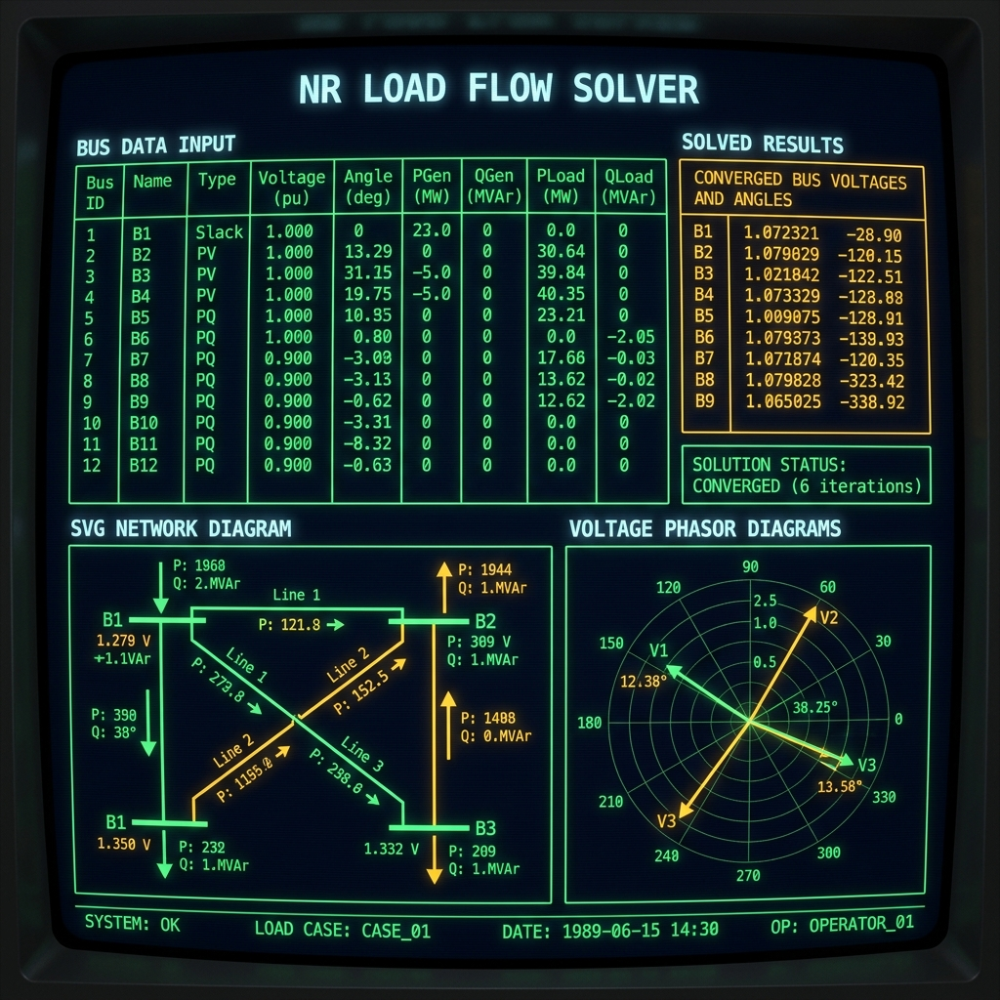

# ⚡ NR Load Flow Solver

**A browser-based Newton-Raphson load flow analysis tool with a retro SCADA control console UI.**

[](LICENSE)
[](https://www.typescriptlang.org/)
[](https://react.dev/)
[](https://vite.dev/)
[]()

---

## 📖 The Story

I'm a 6th-semester B.E. EEE student, and when my Power Systems Analysis class hit the Newton-Raphson method for load flow, I realized there was no quick online tool to verify the hand calculations we were doing in assignments and exams. So I built one — a full NR load flow solver that runs entirely in the browser, shows every Jacobian matrix and mismatch vector at each iteration, and lets you cross-check your work step by step.

---

## 📸 Screenshot

<p align="center">
  
</p>
<p align="center"><em>Retro CRT control console with phosphor green text, amber accents, and scanline effects.</em></p>

---

## 🌐 Live Demo

**👉 [https://shreyash4real.github.io/nr-load-flow-solver/](https://shreyash4real.github.io/nr-load-flow-solver/)**

---

## ✨ Features

- **Newton-Raphson Solver** — Full NR load flow with configurable tolerance and iteration limits
- **Jacobian Audit Log** — Step-by-step iteration log showing $\Delta P$, $\Delta Q$, full Jacobian matrix, and voltage updates
- **Y-bus Matrix** — Admittance matrix display in both rectangular ($G + jB$) and polar ($|Y| \angle \theta$) forms
- **Network Diagram** — Auto-generated SVG topology with animated power flow direction and magnitude
- **Phasor Diagram** — Polar plot of voltage vectors showing magnitude and angle deviations
- **Preloaded Examples** — 2-bus, Saadat 3-bus, and Stagg & El-Abiad 5-bus systems ready to solve
- **Q-Limit Enforcement** — PV buses switch to PQ when reactive power limits are violated
- **Input Validation** — Real-time checks on bus parameters, line data, and solver settings

---

## 🔢 The Math

The solver implements the standard Newton-Raphson method for power flow analysis.

**Power injection equations:**

$$P_i = V_i \sum_{j=1}^{n} V_j \left( G_{ij} \cos\theta_{ij} + B_{ij} \sin\theta_{ij} \right)$$

$$Q_i = V_i \sum_{j=1}^{n} V_j \left( G_{ij} \sin\theta_{ij} - B_{ij} \cos\theta_{ij} \right)$$

where $\theta_{ij} = \theta_i - \theta_j$ and $Y_{ij} = G_{ij} + jB_{ij}$ are elements of the bus admittance matrix.

**Jacobian submatrices:**

$$J = \begin{bmatrix} J_1 & J_2 \\ J_3 & J_4 \end{bmatrix} = \begin{bmatrix} \dfrac{\partial P}{\partial \theta} & \dfrac{\partial P}{\partial |V|} \\[8pt] \dfrac{\partial Q}{\partial \theta} & \dfrac{\partial Q}{\partial |V|} \end{bmatrix}$$

**NR update step:**

$$\begin{bmatrix} \Delta \theta \\ \Delta |V| \end{bmatrix} = J^{-1} \begin{bmatrix} \Delta P \\ \Delta Q \end{bmatrix}$$

The system is solved via Gaussian elimination with partial pivoting (no external math libraries). Iteration continues until convergence:

$$\max\left( |\Delta P|, |\Delta Q| \right) < \varepsilon$$

---

## 🏗️ Architecture

```
src/
├── App.tsx                        # Main dashboard — state management, tabbed terminal UI
├── index.css                      # CRT theme — scanlines, phosphor glow, keyframe animations
├── main.tsx                       # React entry point
├── components/
│   ├── NetworkDiagram.tsx         # SVG grid topology with animated power flow arrows
│   └── PhasorDiagram.tsx          # Polar coordinate voltage vector plot
└── utils/
    ├── complex.ts                 # Complex number arithmetic (add, mul, div, polar ↔ rect)
    ├── powerFlow.ts               # NR engine — Y-bus builder, Jacobian, Gauss elimination
    └── examples.ts                # Preloaded textbook systems (2-bus, 3-bus, 5-bus)

test-solver.ts                     # Validation suite — 35 tests across all example systems
```

---

## 🛠️ Tech Stack

| Layer | Technology |
|-------|-----------|
| Framework | React 19 |
| Language | TypeScript |
| Bundler | Vite |
| Math Engine | Built from scratch — **zero external math libraries** |
| Linear Algebra | Gaussian elimination with partial pivoting |
| Styling | CSS with custom CRT/SCADA theme |
| Icons | Lucide React |

---

## 🚀 Quick Start

```bash
# Clone the repository
git clone https://github.com/shreyash4real/nr-load-flow-solver.git
cd nr-load-flow-solver

# Install dependencies
npm install

# Start the development server
npm run dev
```

Open [http://localhost:5173](http://localhost:5173) in your browser.

---

## 🧪 Testing

Run the full validation suite:

```bash
npx tsx test-solver.ts
```

```
  ✅ 35/35 tests passing
  ── 2-Bus System: convergence, voltage bounds, power balance
  ── Saadat 3-Bus: PV bus regulation, Jacobian dimensions, loss calculations
  ── Stagg 5-Bus: multi-line network, Q-limits, line charging susceptance
```

---

## 📚 Preloaded Examples

| System | Buses | Lines | Bus Types | Source |
|--------|-------|-------|-----------|--------|
| Simple 2-Bus | 2 | 1 | 1 Slack, 1 PQ | Standard academic example |
| Hadi Saadat 3-Bus | 3 | 3 | 1 Slack, 1 PV, 1 PQ | *Power System Analysis* — Hadi Saadat |
| Stagg & El-Abiad 5-Bus | 5 | 7 | 1 Slack, 1 PV, 3 PQ | *Computer Methods in Power System Analysis* |

---

## 💖 Special Thanks

- **Claude & Antigravity** — math auditing & deployment.
- **GitHub CLI (`gh`)** — fast terminal setup & workflow dispatches.
- **Apple MacBooks** — silent compiling & solver dev.
- **Monster Energy (Lando Norris Edition)** — high-octane coding speed.
- **Hadi Saadat, Stagg, and El-Abiad** — textbook power flow benchmarks.

---

## 📄 License

This project is licensed under the MIT License — see the [LICENSE](LICENSE) file for details.

